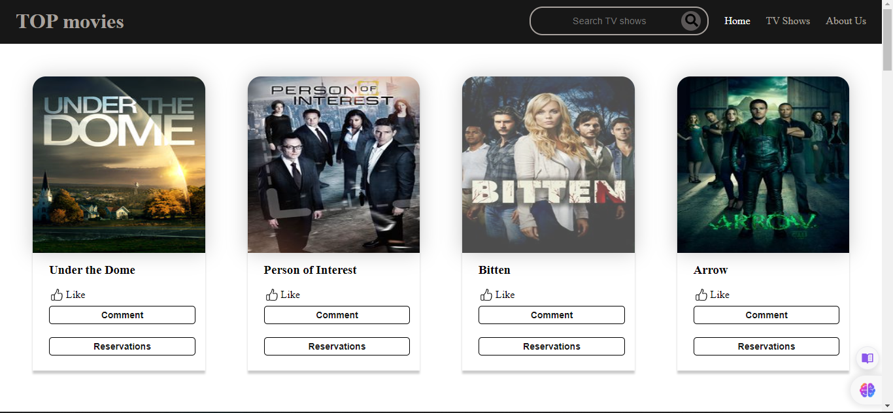
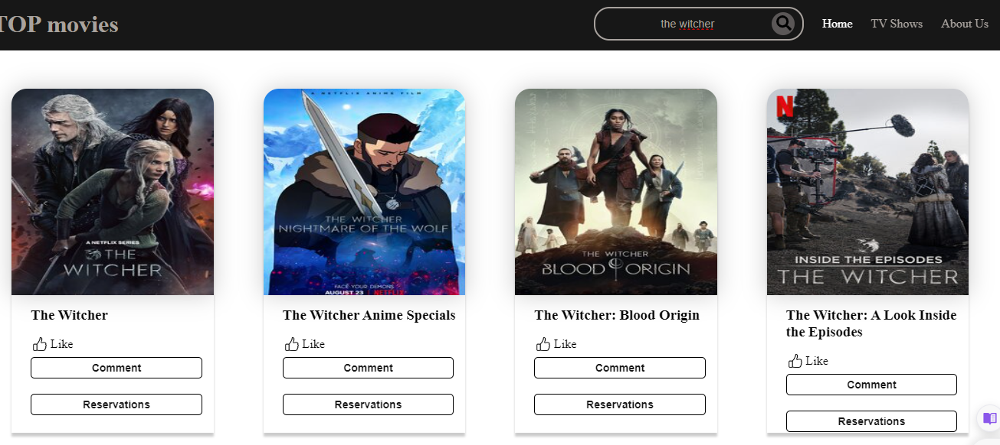
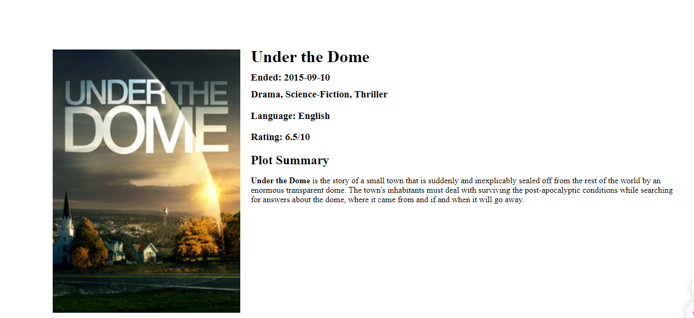
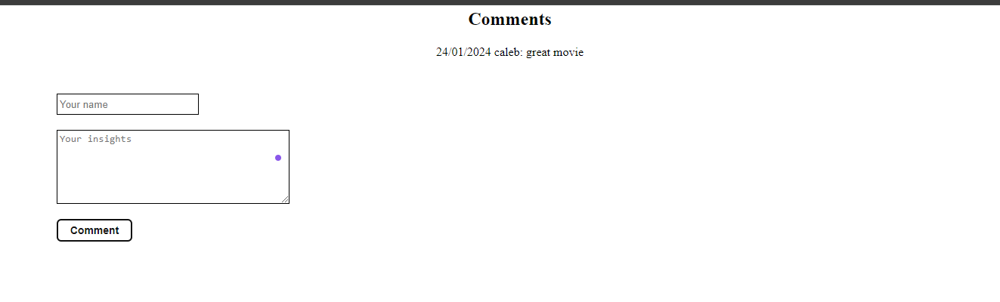
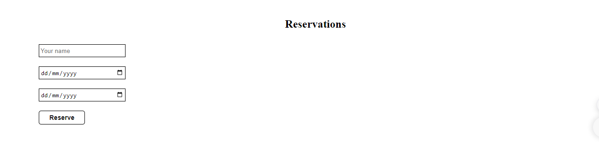
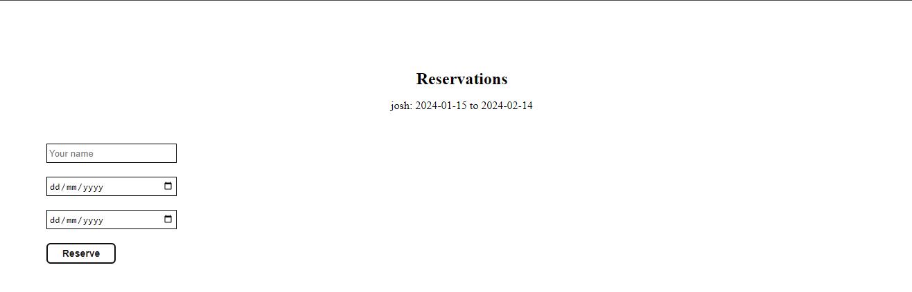
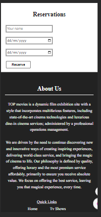

# Capstone-project-II

Welcome to the Capstone II project for TOP Dev Cohort-2! This app interacts with the [TVMazi API](https://api.tvmaze.com/) to fetch and display information about TV shows. The application also allows users to like, comment, and make reservations for shows, storing interactions locally.

## Table of Contents

1. [Introduction](#introduction)
2. [Features](#features)
3. [Demo](#demo)
4. [Technologies Used](#technologies-used)
5. [Project Participants](#project-participants)
6. [Project Structure](#project-structure)
7. [Installation](#installation)
8. [Usage](#usage)
9. [Contributing](#contributing)
10. [Contact](#contact)

## Introduction

The Capstone II project for TOP Dev Cohort-2 focuses on building an application that interacts with the [TVMazi API](https://api.tvmaze.com/). The app is designed to fetch and display information about searched shows and TV shows available on the API, as well as details for each show. Users can like, comment, and make reservations for shows, with interactions stored locally.

## Features

- **TVMazi API Integration:** Fetch data from TVMazi API for searched shows and TV shows available on the API, and the details about each show.
- **User Interaction:** Users can like, comment, and make reservations for shows.
- **Local Storage:** Save user interactions locally to provide a seamless experience.

## Demo

[Link to Live Demo](https://tennjugu.github.io/Capstone-project-II/)

## screenshots










## Technologies Used

The project is built using the following technologies:

- **Webpack:** Module bundler for JavaScript applications.
- **JavaScript:** The primary programming language used for building the application.

## Project Participants

- [**George Ali**](https://github.com/Mogle7Arkad) - handled the design of movie cards, display of movies using the API, implemented the page loader, and the like button
  
- [**Joshua Nathaniel**](https://github.com/Bazzy09) - handled the footer, reservation button and the documentation
  
- [**Jugu Tenerat**](https://github.com/tennjugu) - handled the header, toggle menu, searchShow, comment, movie details, and implemented local storage

## Project Structure

Capstone-project-II/
|- dist/
|   |-- asset
|   |-- screenshots
|   |--index.html
|   |--main.js
|   |--style.css
|-Src/
|   |-- activebtn.js
|   |-- comment.js
|   |-- home.js
|   |-- likes.js
|   |-- loader.js
|   |-- movieDetails.js
|   |-- moviecards.js
|   |-- reservation.js
|   |-- script.js
|   |-- searchShow.js
|   |-- toggleMenu.js
|   |-- tvShows.js
|-- .eslintrc.json
|-- .gitignore
|-- .hintrc
|-- .stylintrc.json
|-- index.html
|-- package-locl.json
|-- package.json
|-- README.md
|-- webpack.config.js

## Installation

To set up the project locally, follow these steps:

1. Clone the repository to your local machine:

   ```bash
   git clone https://github.com/tennjugu/Capstone-project-II.git
   ```

2. Navigate to the project directory:

   ```bash
   cd Capstone-project-II
   ```

3. Install dependencies:

   ```bash
   npm install
   ```

## Usage

Once the installation is complete, you can run the application using the following command:

  ``` bash
   npm start
   ```

This will start the application, using live server

## Contributing

We welcome contributions! If you'd like to contribute to the project, please follow these steps:

1. Fork the repository.

2. Create a new branch for your feature: git checkout -b feature-name

3. Commit your changes: git commit -m 'Add some feature'

4. Push to the branch: git push origin feature-name

5. Create a pull request.

Feel free to reach out if you have any questions or need further clarification on any aspect.

## Contact

For inquiries, please contact [Tenerat Jugu, George Ali, and Joshua Nathaniel] at <topdevelopers@gmail.com>.
